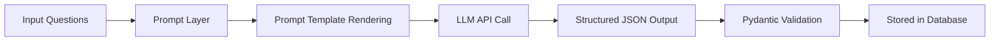
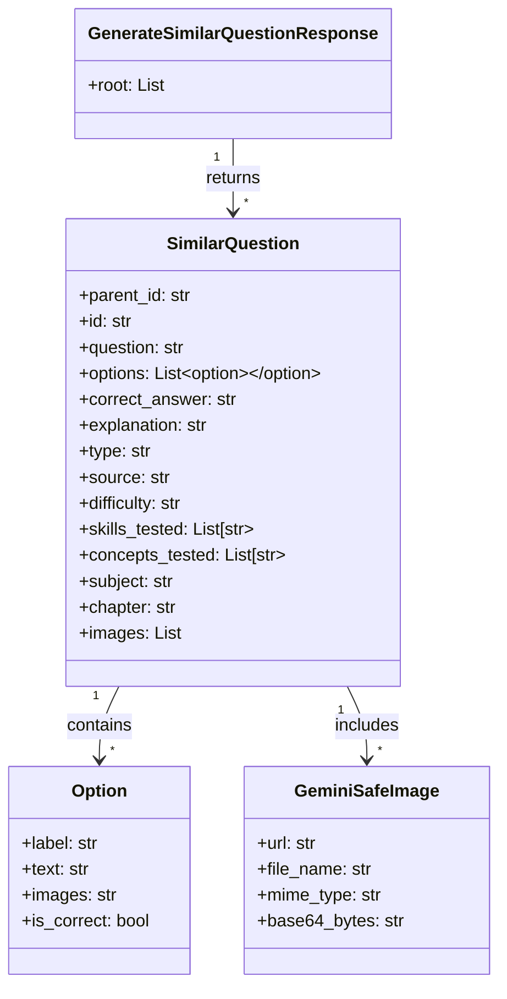
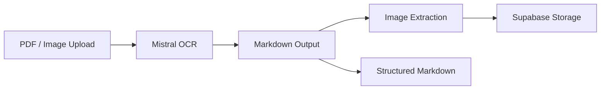
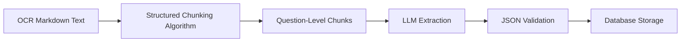
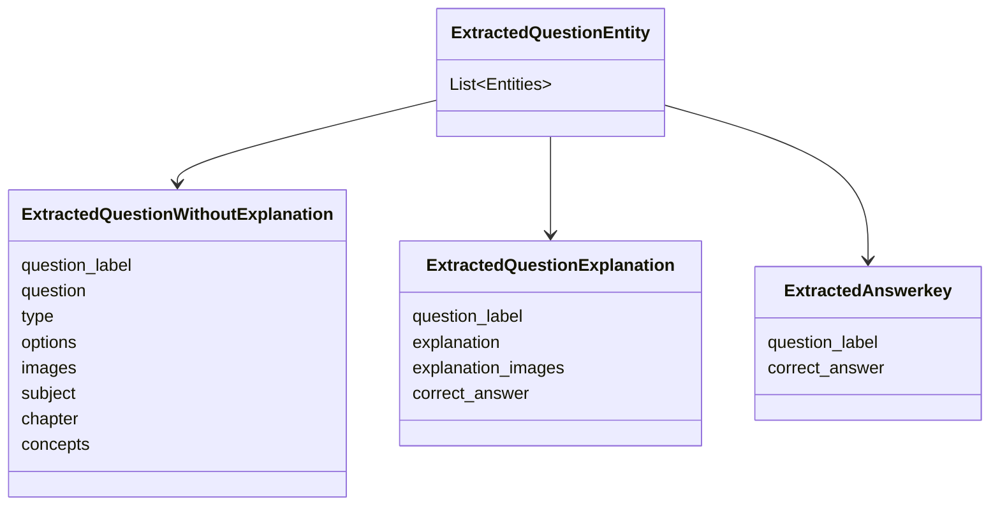
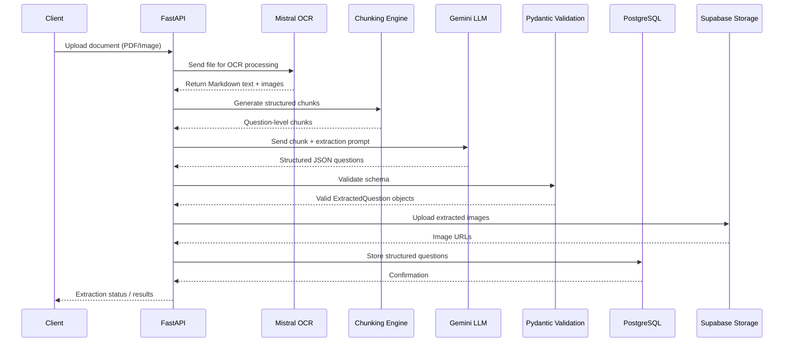
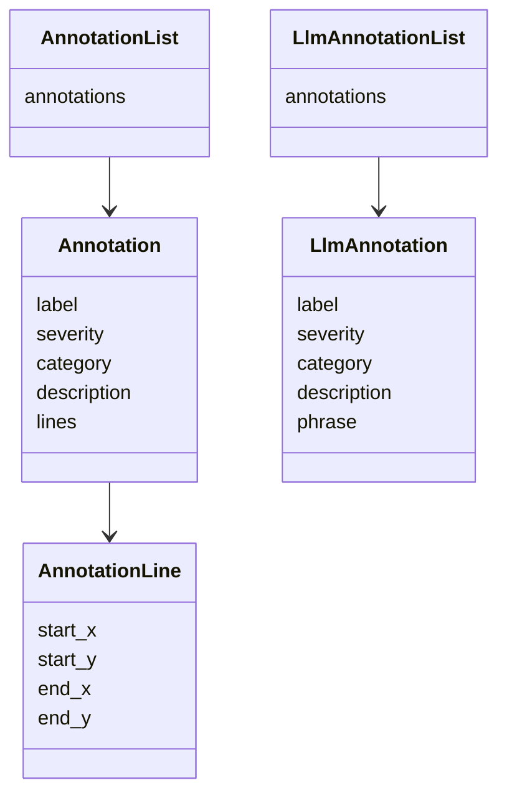
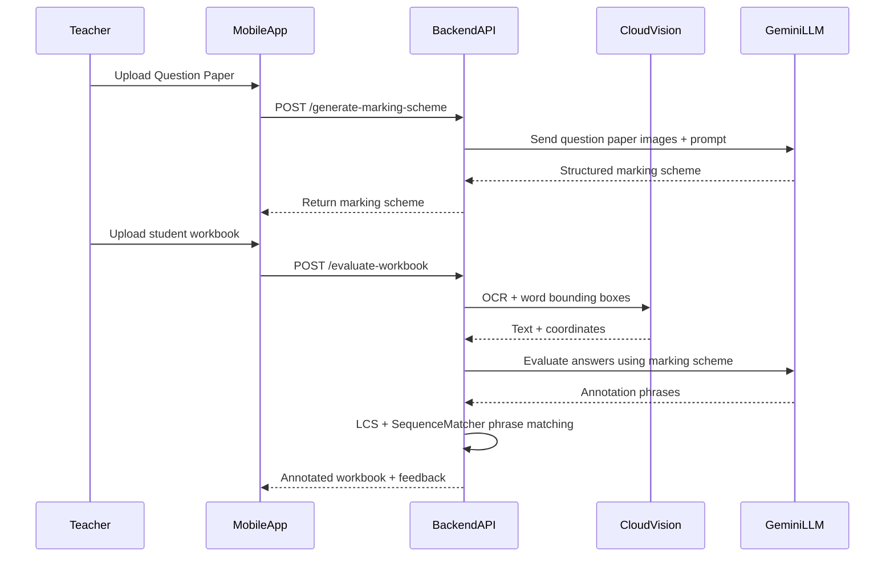

## Introduction

At the end of my sophomore year at NIT Karnataka, I started searching for research internships in AI/ML at institutes like IITs, IISc, and other research labs. I was very interested in getting hands-on experience in artificial intelligence and machine learning through academic research.

During this process, I was fortunate enough to secure a few research opportunities, including:

- Research Intern at IIT Dharwad  
- Research Intern in Explainable AI at IIT Jammu  

While these were great opportunities, something unexpected happened in April.

## Joining Kalppo
Through the Web Enthusiasts Club (WEC)  a great technical club at NITK I got a referral for an internship at **Kalppo**, an EdTech startup. The referral came from a senior in the club who was already working there as an intern. He introduced me to the team at Kalppo and suggested that I go through the interview process.

I agreed to take the interview.

My technical interview was conducted in the last week of April by [Abhishek Kumar](https://www.linkedin.com/in/abhishekkumar2718/), the CTO and Tech Lead at Kalppo. The interview mostly revolved around my resume, the projects I had worked on, and my experience with machine learning systems.

We discussed things like:

- My work with vector databases  
- The ML systems I had built  
- My experience participating in Kaggle competitions  

One of the highlights discussed during the interview was my result in the **Kaggle × Skill Assessment Machine Learning Competition**, where I was ranked **1st out of 1,846 participants**.

The interview was quite technical but also very interesting because it focused on how I approached problems and built systems, rather than just theoretical questions.

About two days later, I received a call from [Avinash Kumar](https://www.linkedin.com/in/avinash136/), CEO at Kalppo. We discussed the role, expectations, and a few details about the internship.

The very next day, I received the confirmation 🙂

My internship at **Kalppo** officially started on May 10th and continued until July 20th.

Those two months turned out to be one of the most challenging, interesting, and enjoyable experiences I had during my early years in tech. It was my first time working professionally as an AI Engineer Intern, and doing it in a fast-moving EdTech startup environment made the experience even more intense and exciting.

In the following sections, I will talk about the projects I worked on, the people I interacted with, and the things I learned during this journey at Kalppo.


## Team and Mentors

In the first week of May, around 3 interns were selected to join Kalppo. We had our first team meeting where Abhishek Kumar and Avinash Kumar introduced us to the team and the product they had been building over the past six months.

During the meeting, they gave us a demo of the platform and explained the main idea behind the startup. Kalppo is an EdTech startup focused on helping offline coaching institutes bring their teaching systems online.

The product was designed to help coaching institutes:

* create and manage batches of students
* conduct mock quizzes and tests
* manage learning material and progress tracking

The primary focus was on JEE and NEET coaching, which makes sense because many coaching institutes in India operate offline on a relatively small scale. The idea was simple but powerful provide them with tools to run their coaching programs online for their students.

Apart from this core product, the team was also working on several other supporting tools and features that could improve the learning experience for both teachers and students.

After the introduction and product demo, we had a fun activity to break the ice. Everyone had to share three statements about themselves, where two statements were true and one was false, and the rest of the group had to guess which one was incorrect.

It was a simple but very engaging activity and helped everyone get comfortable with each other. Since many of us were meeting for the first time, it made the environment much more relaxed.

Overall, it was a great experience meeting the team and mentors. The session helped us understand the **vision behind the startup**, the product they were building, and the people we would be working with over the next few months.

## Projects I Worked On

During my internship at Kalppo, I worked on multiple AI-driven systems aimed at improving automation within the EdTech platform. The primary focus of these projects was to automate question generation, question extraction from educational documents, and student answer evaluation. These systems helped reduce manual effort for educators while enabling scalable content creation and assessment.

> STEM Question Generation
- Built a system to automatically generate **similar STEM questions** from an existing question.

> AI Question Extraction Pipeline
- Developed a pipeline to **extract questions from educational documents** such as PDFs and scanned worksheets.

> Workbook Evaluation App
- Built an **AI-powered evaluation system** for assessing student workbook answers.


### 1. STEM Question Generation

After our initial onboarding meeting, the following Monday I had a one-on-one discussion with Abhishek Kumar (CTO) regarding my experience with AI frameworks and the projects I had previously worked on.

Based on this discussion, the first major task assigned to me was to build a system that could generate k similar questions for a given input question.

The idea was simple:

- Take an existing JEE-level question
- Generate **multiple variations of the same concept**
- Store them in the database
- Expand the **practice question bank** for coaching institutes

This helps students practice more problems that test the same concept with slightly different variations.


#### Experimenting with AI Workflows

I started experimenting with different AI workflows inside Jupyter notebooks.

The basic pipeline looked like this:

1. Input question
2. Prompt generation
3. Send prompt to LLM
4. Parse structured JSON output
5. Store in database

#### Prompt Layer

To generate similar questions, I first designed a **prompt layer** responsible for converting input questions into structured prompts for the LLM.

Instead of writing raw prompts everywhere in the codebase, I created a prompt management layer that dynamically renders prompts depending on:

- subject (math / physics / chemistry)
- chapter
- number of variations required
- question type

For example, chemistry questions belonging to organic chemistry chapters used a different prompt template because they required SMILES representations for molecular structures.


#### Prompt Rendering Logic

Below is the simplified Python implementation used to render prompts.

```python
from app.prompts.prompt_manager import PromptManager
from app.schema.question import Question
import json

class GenerateSimilarQuestionPrompt:

    _supported_subjects = {"math", "physics", "chemistry"}

    _organic_chapters = {
        "Alkanes",
        "Alkenes and Alkynes",
        "Alcohols",
        "Aldehydes and Ketones",
        "Carboxylic Acids",
        "Aromatic Compounds (Benzene and its Derivatives)"
    }

    @staticmethod
    def render(questions: list[Question], subject: str, k: int) -> str:

        subject = subject.lower()

        if subject not in GenerateSimilarQuestionPrompt._supported_subjects:
            raise ValueError("Unsupported subject")

        questions_json = json.dumps([
            {
                "id": q.id,
                "question": q.question,
                "subject": q.subject,
                "options": [opt.model_dump() for opt in q.options] if q.options else [],
                "type": q.type,
                "chapter": q.chapter,
            }
            for q in questions
        ], indent=2)

        return PromptManager.render(
            "generate_similar_question_prompt",
            questions_json=questions_json,
            subject=subject,
            k=k
        )
```

This prompt was then sent to the LLM, which generated similar questions in structured JSON format.


#### Prompt Generation Pipeline

The overall prompt pipeline looked like this:




#### Why a Prompt Layer Was Important

This abstraction allowed the system to:

* reuse prompt templates across subjects
* dynamically modify prompts depending on chapters
* maintain versioned prompts
* enforce structured outputs

It also made experimentation easier when testing different prompt strategies for **STEM question generation**.


#### LLM Model

For the generation pipeline I used:

* **Gemini 2.5**
* **Gemini 2 Pro**

These models worked well for generating conceptually similar but diverse questions.

I used the Gemini Python API together with **Pydantic schemas** to validate responses.

#### Question Schema

The generated questions were validated using a Pydantic schema.



This ensured that the LLM output always followed the correct structured format.


#### Backend API

Once the pipeline was stable, I built a **FastAPI endpoint** that allowed the system to generate similar questions.

Example endpoint:

```python
from fastapi import APIRouter
from typing import List

router = APIRouter()

@router.post("/generate_similar_question")
def generate_similar_question_route(request):
    similar_questions = generate_similar_question(
        questions=request.questions,
        subject=request.questions[0].subject,
        number_of_generated_questions_per_question=request.number
    )
    return {"similar_questions": similar_questions}
```

The API:

* accepts a list of questions
* generates variations
* returns structured JSON


#### Handling Subject-Specific Content

Each subject required slightly different handling.

#### Mathematics

Math questions mainly relied on **LaTeX formatting** and symbolic expressions.


#### Chemistry (SMILES notation)

For organic chemistry questions, I used **SMILES representation** to generate molecular structures.

Example:

```
<smiles>CC(O)=O</smiles>
```

This allowed the system to generate organic chemistry questions involving **molecular structures**.


#### Physics (Circuit Diagrams)

For chapters like:

* Current Electricity
* Alternating Current
* Capacitance

I used **LaTeX + CircuitTikZ** to generate circuit diagrams.

Example:

```latex
\begin{circuitikz}
(0,0) to[sV, l=$V_p\sin(\omega t)$] (0,4)
to[R, l=$R$] (4,4)
to[C, l=$C$] (4,0)
to[short] (0,0);
\end{circuitikz}
```

These diagrams were rendered into images and attached to questions.

<div class="row mt-3">
    <div class="col-sm-8 mt-3 mt-md-0">
        
    </div>
</div>

<div class="caption">
Example circuit diagram generated using LaTeX CircuitTikZ and rendered into an image by the pipeline.
</div>

#### Example Result: Generated Question Variations

Below is an example showing how the system generates multiple variations of a given question while preserving the underlying concept.


#### Original Question

**Question ID:** B-33  

**Question**

Evaluate the integral:

$$
\int_{-1}^{1} \cot^{-1}\left(\frac{x + x^{3}}{1 + x^{4}}\right) \, dx
$$

**Options**

- **A**: $2\pi$
- **B**: $\frac{\pi}{2}$
- **C**: $0$
- **D**: $\pi$

**Correct Answer:** **D** — $\pi$


#### Generated Variation 1

**Question ID:** B-33  
**Sub ID:** B-33-1

**Question**

Evaluate

$$
\int_{0}^{1} \tan^{-1}\left(\frac{2x}{1 - x^2}\right) \, dx
$$

**Options**

- **A**: $\frac{\pi}{2}$
- **B**: $\frac{\pi}{4}$
- **C**: $0$
- **D**: $\pi$

**Correct Answer:** **D** — $\pi$


#### Generated Variation 2

**Question ID:** B-33  
**Sub ID:** B-33-2

**Question**

Find the value of

$$
\int_{-\pi/2}^{\pi/2} \sin^{-1}\left(\frac{2x}{1+x^2}\right) \, dx
$$

**Options**

- **A**: $0$
- **B**: $\pi$
- **C**: $\frac{\pi}{2}$
- **D**: $-\pi$

**Correct Answer:** **A** — $0$


#### System Architecture Diagram

```typograms
-------------------------------------------------------------------------------------------------------.
|                                     STEM QUESTION GENERATION SYSTEM                                  |
'-------------------------------------------------------------------------------------------------------'
            |
            v
.-------------------------------------------------------------------------------------------------------.
|                                         FASTAPI BACKEND API                                           |
|                                                                                                       |
|   POST /generate_similar_question                                                                     |
|   - Accepts list of questions                                                                         |
|   - Accepts number_of_generated_questions_per_question                                                |
'-------------------------------------------------------------------------------------------------------'
            |
            v
.-------------------------------------------------------------------------------------------------------.
|                                          REQUEST PARSER                                               |
|                                                                                                       |
|  - Pydantic Schema Validation                                                                         |
|  - Question Object Conversion                                                                         |
|  - Subject Detection (Math / Physics / Chemistry)                                                     |
'-------------------------------------------------------------------------------------------------------'
            |
            v
.-------------------------------------------------------------------------------------------------------.
|                                            PROMPT LAYER                                               |
|                                                                                                       |
|  Jinja Prompt Template                                                                                |
|                                                                                                       |
|  - GenerateSimilarQuestionPrompt.render()                                                             |
|  - Dynamic Prompt Versioning                                                                          |
|  - Organic Chemistry Detection                                                                        |
|  - Inject Question JSON                                                                               |
|                                                                                                       |
|  Output → Structured LLM Prompt                                                                       |
'-------------------------------------------------------------------------------------------------------'
            |
            v
.-------------------------------------------------------------------------------------------------------.
|                                         GEMINI LLM CALL                                               |
|                                                                                                       |
|   Google Gemini API                                                                                   |
|                                                                                                       |
|   Models Used                                                                                         |
|   - gemini-2.5-pro                                                                                    |
|   - gemini-2.0-flash                                                                                  |
|                                                                                                       |
|   Task                                                                                                 |
|   - Generate K Similar Questions                                                                      |
|   - Maintain Concept Consistency                                                                      |
|   - Produce Structured JSON Output                                                                    |
'-------------------------------------------------------------------------------------------------------'
            |
            v
.-------------------------------------------------------------------------------------------------------.
|                                      STRUCTURED OUTPUT VALIDATION                                     |
|                                                                                                       |
|  Parse JSON Response                                                                                  |
|                                                                                                       |
|  Pydantic Models                                                                                      |
|     SimilarQuestion                                                                                   |
|     Option                                                                                            |
|     GeminiSafeImage                                                                                   |
|                                                                                                       |
|  Ensures                                                                                              |
|  - Schema correctness                                                                                 |
|  - Correct question structure                                                                         |
|  - Valid options and answers                                                                          |
'-------------------------------------------------------------------------------------------------------'
            |
            v
.-------------------------------------------------------------------------------------------------------.
|                               OPTIONAL PHYSICS CIRCUIT DIAGRAM GENERATION                             |
|                                                                                                       |
|   If Chapter ∈ { Current Electricity, Capacitance, AC }                                               |
|                                                                                                       |
|      Gemini → Generate CircuitTikZ LaTeX Code                                                         |
|      ↓                                                                                                |
|      LaTeX Rendering Engine                                                                           |
|      ↓                                                                                                |
|      Convert → PNG Image                                                                              |
|      ↓                                                                                                |
|      Upload → Supabase Storage                                                                        |
'-------------------------------------------------------------------------------------------------------'
            |
            v
.-------------------------------------------------------------------------------------------------------.
|                                      DATABASE STORAGE LAYER                                           |
|                                                                                                       |
|  PostgreSQL                                                                                           |
|                                                                                                       |
|  Tables                                                                                                |
|   - Questions                                                                                         |
|   - Options                                                                                           |
|   - Images                                                                                            |
|                                                                                                       |
|  Stored Data                                                                                          |
|   - Generated Question Variations                                                                     |
|   - Answers & Explanations                                                                            |
|   - Circuit Diagrams                                                                                  |
'-------------------------------------------------------------------------------------------------------'
            |
            v
.-------------------------------------------------------------------------------------------------------.
|                                        FINAL API RESPONSE                                             |
|                                                                                                       |
|  FastAPI returns                                                                                      |
|                                                                                                       |
|  GenerateSimilarQuestionResponse                                                                      |
|                                                                                                       |
|  JSON Response                                                                                        |
|                                                                                                       |
|  {                                                                                                    |
|      "similar_questions": [...]                                                                       |
|  }                                                                                                    |
'-------------------------------------------------------------------------------------------------------'
```

### 2. AI Question Extraction Pipeline

One of the major tasks during my internship was building an AI Question Extraction Pipeline.

The goal of this system was to automatically extract questions from educational documents such as:

- Previous Year Question Papers (PYQs)
- DPPs (Daily Practice Problems)
- Coaching Modules
- Handwritten Notes
- Worksheets
- Mock Test Papers

and convert them into structured question objects that could be stored in the database.

Many interns had attempted solving this problem earlier, but building a reliable production-ready solution turned out to be quite challenging.


#### Initial Experiments

Initially, I experimented with **DSPy**, a framework designed for building LLM pipelines.

DSPy allows:

- better prompt engineering
- training LLMs on structured datasets
- automatic evaluation of LLM outputs
- optimization of prompts through feedback loops

While DSPy was powerful, the pipeline became too heavy and complex for our use case, and the task needed to be delivered quickly.

So I decided to rethink the approach.

#### Microservices Approach

Instead of solving the entire problem at once, I broke the system into smaller independent services.

The pipeline was divided into stages:

1. Document → OCR
2. OCR → Markdown text
3. Markdown → Semantic chunks
4. Chunks → Question extraction
5. Validation → Database storage

Breaking the system into microservices allowed each stage to be independently optimized and debugged.


#### Step 1: Extracting Text from Documents (OCR)

The first major problem was converting the uploaded PDF or image documents into textual data.

For this, I used **Mistral OCR**, which at the time was one of the best OCR systems available.

Key advantages of Mistral OCR:

- Maintains mathematical formulas in LaTeX
- Preserves tables and MCQ formatting
- Extracts diagrams and images
- Maintains organic chemistry structures
- Outputs Markdown formatted text

This was extremely useful because JEE / NEET questions heavily depend on mathematical expressions.


#### Example Extracted Markdown

Below is an example of markdown extracted from a question paper.

```markdown
# SECTION - I  
(SINGLE CORRECT ANSWER TYPE)

This section contains 20 multiple choice questions.

1. Consider the ratio  
$r=\frac{(1-a)}{(1+a)}$  

If the error in measurement of $a$ is $\Delta a$, then the maximum possible error in $r$ is:

1) $\frac{\Delta a}{(1+a)^2}$  
2) $\frac{2\Delta a}{(1+a)^2}$  
3) $\frac{2\Delta a}{(1-a^2)}$  
4) $\frac{2a\Delta a}{(1-a^2)}$
````

As you can see, the OCR output preserves:

* **LaTeX formulas**
* **MCQ options**
* **document structure**

This made it much easier to process questions downstream.

#### OCR Processing Service

Below is a simplified version of the OCR service.

```python
from mistralai import Mistral
from pydantic import BaseModel, HttpUrl
import filetype

client = Mistral(api_key="MISTRAL_API_KEY")

class TranscribeResponse(BaseModel):
    markdown_text: str
    num_pages: int

def transcribe(file_url: HttpUrl) -> TranscribeResponse:

    # call mistral OCR
    ocr_response = client.ocr.process(
        model="mistral-ocr-latest",
        document={"type": "document_url", "document_url": file_url}
    )

    markdown_text = ""

    for page in ocr_response.pages:
        markdown_text += page.markdown + "\n\n"

    return TranscribeResponse(
        markdown_text=markdown_text.strip(),
        num_pages=len(ocr_response.pages)
    )
```

This service:

1. downloads the document
2. sends it to **Mistral OCR**
3. receives structured OCR output
4. converts it into **clean Markdown text**



At this point, we had successfully converted raw documents into structured Markdown text.

The next challenge was to extract individual questions from this Markdown, which required a completely different AI pipeline.

#### Step 2: Extracting Individual Questions from Markdown

The first step (OCR → Markdown conversion) was already implemented by several interns.

However, the **real challenge** started in the next stage  extracting each individual question in a structured format so that it could be stored in the database.

The OCR output for a typical **JEE test paper containing ~90 questions** produced around:

- **25–30 pages of Markdown**
- roughly **50,000–60,000 characters**

Sending the entire document to an LLM at once was impossible because of token limits.

At that time:

- maximum **output tokens ≈ 32k**
- maximum **input tokens ≈ 8k**

So the document had to be split into smaller chunks.

#### The Naive Chunking Approach

The obvious approach would be:

> Split the Markdown text into smaller chunks and send each chunk to the LLM.

However, this approach quickly failed.

Because the chunking was random, it often separated:

- the **question statement**
- the **options**
- the **answer / explanation**

into **different chunks**.

Example problem:

```markdown
Chunk 1:
Question statement

Chunk 2:
Options A B C D
```

In such cases, the LLM could not understand that both pieces belonged to the same question.

This resulted in:
- orphan questions
- incomplete options
- hallucinated questions

For an EdTech platform, accuracy was extremely important. Coaching institutes wanted exact question extraction, not AI-generated approximations.
So this approach was not acceptable.

#### Semantic Chunking Attempt

The next idea was to use **semantic chunking**, which is commonly used in industry for splitting large documents before sending them to LLMs.

The idea is simple:

1. Convert text into embeddings
2. Split the document at semantic boundaries

This method is much smarter than random splitting.

Example implementation:

```python
from langchain_openai import OpenAIEmbeddings
from langchain_experimental.text_splitter import SemanticChunker

def generate_semantic_chunks(markdown_text: str):

    embeddings = OpenAIEmbeddings(
        model="text-embedding-3-large"
    )

    chunker = SemanticChunker(
        embeddings,
        min_chunk_size=400,
        breakpoint_threshold_type="percentile",
        breakpoint_threshold_amount=95
    )

    return chunker.split_text(markdown_text)
```

While this approach worked well for general text documents, it still had problems for exam papers.

#### Extraction Pipeline Overview

Or visually:




#### Step 3: LLM Extraction Layer

Once the document was converted into structured question-level chunks, the next step was to extract questions in a fully structured format.

Each chunk was sent to an LLM extraction layer, where a generalized prompt instructed the model to identify:

- question statements
- options
- correct answers
- explanations
- associated images or diagrams

The goal was to convert raw chunk text into structured question objects that could be stored in the database.


#### Parallel Chunk Processing

Since a document could contain 50–100 questions, each chunk was processed **concurrently** to improve performance.

Below is a simplified version of the extraction pipeline.

```python
import asyncio
from concurrent.futures import ThreadPoolExecutor

async def extract_questions_from_chunks(chunks):

    executor = ThreadPoolExecutor(max_workers=4)

    def process_chunk(chunk_text):

        prompt = ExtractQuestionEntityPrompt.render(chunk_text)

        response = gemini.generate_content(
            model="gemini-2.5-flash",
            contents=[prompt]
        )

        json_output = parse_json(response.text)

        return ExtractedQuestionEntity.model_validate(json_output)

    loop = asyncio.get_running_loop()

    tasks = [
        loop.run_in_executor(executor, process_chunk, chunk)
        for chunk in chunks
    ]

    results = await asyncio.gather(*tasks)

    entities = []
    for r in results:
        entities.extend(r.root)

    return entities
```

Key ideas in this stage:

* Each chunk is processed **independently**
* Gemini generates **JSON structured outputs**
* Pydantic validates schema correctness
* The system merges entities into final question objects

#### Schema Validation Layer

To ensure the LLM output was correct and reliable, I used Pydantic schemas.

These schemas validated:

* question text
* options
* answers
* explanations
* associated images

Example simplified schema:

```python
from pydantic import BaseModel
from typing import List, Optional
from enum import StrEnum

class QuestionType(StrEnum):
    MULTIPLE_CHOICE = "multiple_choice"
    NUMERICAL = "numerical"
    TEXT = "text"

class Option(BaseModel):
    label: str
    text: str
    is_correct: bool

class ExtractedQuestion(BaseModel):
    question_label: str
    question: str
    type: QuestionType
    options: Optional[List[Option]]
    correct_answer: Optional[str]
    explanation: Optional[str]
```
The schemas guaranteed that the LLM output always matched the expected structure before storing it in the database.

#### Prompt Rendering Layer

Prompts were rendered dynamically using a PromptManager.

```python
class ExtractQuestionEntityPrompt:

    _version = "202506062213"

    @staticmethod
    def render(chunk: str):

        return PromptManager.render(
            "extract_question_entity_prompt",
            ExtractQuestionEntityPrompt._version,
            chunk=chunk
        )
```

This made it easy to version prompts and improve extraction quality without changing the code.

#### Question Extraction Pipeline


#### Extracted Entity Schema

The system supported three entity types:

1. **Question without explanation**
2. **Explanation entity**
3. **Answer key entity**

These entities were later merged into a final **ExtractedQuestion object**.



#### Step 4: API Orchestration and Database Storage

After building the OCR layer, chunking layer, and LLM extraction layer, the final step was to expose the entire pipeline through a FastAPI endpoint.

This endpoint acts as the entry point for the extraction system, allowing coaching institutes or internal services to submit a document for question extraction.

The pipeline performs the following steps:

1. Receive extraction request
2. Run OCR on the uploaded document
3. Convert the document into Markdown
4. Split the Markdown into structured chunks
5. Send chunks to the LLM extraction layer
6. Validate structured outputs
7. Store extracted questions in the database

Because extracting questions from a large document could take several seconds to minutes, the extraction process was implemented using **background tasks**.

This allowed the API to return immediately while the extraction pipeline continued processing asynchronously.


#### FastAPI Endpoint

Below is a simplified version of the API endpoint.

```python
from fastapi import APIRouter, BackgroundTasks
from pydantic import BaseModel

router = APIRouter()

class ExtractQuestionRequest(BaseModel):
    long_running_operation_id: str

@router.post("/extract_question_entity")
async def extract_question_entity_route(request: ExtractQuestionRequest,
                                         background_tasks: BackgroundTasks):

    background_tasks.add_task(
        process_extract_question_entity_task,
        request.long_running_operation_id
    )

    return {"status": "Processing started"}
```

This endpoint:

* receives a **long running operation id**
* schedules the extraction pipeline
* returns immediately with a **processing status**

#### Extraction Pipeline Orchestration

The background task coordinates all pipeline components.

```python
def process_extract_question_entity_task(operation_id):

    # Step 1: OCR
    transcription = transcribe(file_url)

    # Step 2: Chunking
    if transcription.num_pages < 3:
        chunks = [transcription.markdown_text]
    else:
        chunks = generate_semantic_chunks(transcription.markdown_text)

    # Step 3: LLM Extraction
    extracted_questions = asyncio.run(
        extract_questions_from_chunks(chunks)
    )

    # Step 4: Store results
    save_questions_to_database(extracted_questions)
```

This function combines the three previously built microservices:

* OCR service
* chunking service
* LLM extraction service

#### Database Storage

Once questions were extracted and validated, they were stored in the database.

Each question record contained:

* question text
* options
* correct answer
* explanation
* subject
* chapter
* related images

The pipeline stored both:

* **processed questions**
* **raw extraction output**

#### Final Pipeline Architecture



### 3. Workbook Evaluation App

This project focused on building an AI-powered system that could automatically evaluate student workbook answers. The application was designed primarily for teachers, tutors, and coaching institutes. Teachers could upload scanned copies of student workbooks, and the system would analyze the answers, evaluate them according to the CBSE marking scheme, and provide feedback to students.

The main objective was to build a solution for Class 6–10 students covering subjects such as **Science, Mathematics, and English**. The evaluation system aimed to reduce the manual grading workload for teachers while also giving students clear feedback to improve their learning.

Initially, the idea looked promising, but the implementation approach was not clear. During the early second week of June, a meeting was held with Abhishek Kumar, Avinash Kumar, Rahul (frontend intern), and myself to discuss how the system could be implemented. My responsibility was to design and build the backend AI evaluation service, while the frontend integration and application interface were handled by Abhishek and Rahul.

#### System Design Overview

The core workflow involved converting scanned workbook pages into structured information and then using AI models to evaluate the answers.


The pipeline performs the following major tasks:

* Convert scanned workbook images into text using OCR.
* Extract word-level coordinates to identify exact positions in the document.
* Use an LLM to analyze answers according to a predefined marking scheme.
* Map LLM feedback back to the workbook image using bounding boxes.
* Display visual annotations such as underlines or highlights for incorrect answers.

#### OCR and Text Extraction

One of the first challenges was converting workbook images into machine-readable text while also preserving the coordinates of each word.

Initially, I experimented with **Mistral OCR**, which produced good text results but did not provide bounding box information required for drawing annotations.

The final approach used **Google Cloud Vision**, which provided both:

* extracted text
* bounding box coordinates for each detected word

A simplified implementation is shown below.

```python
from google.cloud import vision

def get_words(image):
    client = vision.ImageAnnotatorClient()
    response = client.text_detection(image=image)

    words = []
    for text in response.text_annotations[1:]:
        vertices = text.bounding_poly.vertices
        words.append({
            "word": text.description,
            "x1": vertices[3].x,
            "y1": vertices[3].y,
            "x2": vertices[2].x,
            "y2": vertices[2].y
        })

    return words
```

This step allowed the system to later draw annotations directly on the workbook image.


#### LLM-based Answer Evaluation

Once the workbook text was extracted, the next step was to evaluate answers using an LLM with a predefined marking scheme.

The LLM receives:

* workbook image
* marking scheme
* evaluation instructions

The model then returns structured annotations describing mistakes or feedback.

Example simplified function:

```python
def get_annotations_from_llm(image_url, marking_scheme):
    response = gemini.generate(
        image=image_url,
        prompt="Evaluate student answer using marking scheme",
        schema=LlmAnnotationList
    )
    
    return response
```

The output includes information such as:

* question label
* severity of issue
* category of error
* phrase triggering the annotation
* feedback description


#### LCS-based Phrase Matching with SequenceMatcher

When the LLM evaluates an answer, it returns a phrase that triggered the annotation.  
However, OCR output is often noisy — words may be slightly misspelled or split incorrectly.  
Because of this, an exact string match is unreliable.

To solve this, a Longest Common Subsequence (LCS) based fuzzy matching approach was used along with Python's `SequenceMatcher`.

This method allows the system to:
- tolerate small OCR mistakes
- find approximate matches between the LLM phrase and OCR words
- correctly locate the **bounding box coordinates** of the phrase in the original document

#### Why SequenceMatcher was Used

`SequenceMatcher` computes a similarity ratio between two strings.  
This helps determine whether two words are likely to represent the same word even if OCR introduced small errors.

Example:
student_answer → student_answr
similarity ≈ 0.92

Because the similarity score is high, the system treats the words as a match.

This approach improves robustness when working with:
- scanned worksheets
- handwritten or low-quality scans
- OCR misread characters

#### Character Similarity Function

A simple similarity function was implemented using `SequenceMatcher`.

```python
from difflib import SequenceMatcher

def char_similarity(a: str, b: str) -> float:
    """
    Computes similarity between two words.
    Returns a score between 0 and 1.
    """
    return SequenceMatcher(None, a.lower(), b.lower()).ratio()
```

Example usage:

```python
print(char_similarity("answer", "answr"))   # ~0.83
```

#### LCS Phrase Matching Algorithm

The system then applies a **Longest Common Subsequence (LCS)** strategy to match a multi-word phrase against OCR words.

Simplified implementation:

```python
from difflib import SequenceMatcher

def fuzzy_lcs_match(words, phrase, char_threshold=0.7):
    """
    Finds approximate phrase matches using LCS + SequenceMatcher.
    """

    phrase_words = phrase.split()
    n = len(words)
    m = len(phrase_words)

    dp = [[0]*(m+1) for _ in range(n+1)]

    for i in range(n):
        for j in range(m):
            sim = SequenceMatcher(
                None,
                words[i].lower(),
                phrase_words[j].lower()
            ).ratio()

            if sim >= char_threshold:
                dp[i+1][j+1] = dp[i][j] + 1
            else:
                dp[i+1][j+1] = max(dp[i][j+1], dp[i+1][j])

    return dp[n][m]
```

The function computes the length of the longest matching subsequence between the OCR words and the phrase returned by the LLM.

#### Matching Strategy

The algorithm works in two stages:

1. **Word similarity check**
   * Compare OCR word with phrase word
   * Use `SequenceMatcher` similarity ratio

2. **LCS dynamic programming**
   * Track the longest sequence of matching words
   * Determine whether the phrase sufficiently matches the document

#### Annotation Generation

Once matching words are found, the system generates line coordinates that can be drawn on the workbook image.

```python
annotation_line = {
    "start_x": word_start_x,
    "start_y": word_start_y,
    "end_x": word_end_x,
    "end_y": word_end_y
}
```

These coordinates allow the frontend to display:

* underlines
* highlights
* error markers

directly on the student workbook image.

#### Evaluation Pipeline

The full evaluation pipeline combines OCR processing and LLM analysis in parallel.

```python
def evaluate_assessment(image_url, marking_scheme):
    llm_annotations = get_annotations_from_llm(image_url, marking_scheme)
    words = get_words(image_url)

    final_annotations = merge_annotations(llm_annotations, words)

    return final_annotations
```

This produces a structured list of annotations that the frontend can render visually.

#### Annotation Data Model

The system uses structured schemas to represent annotations generated during evaluation.



#### Marking Scheme Generation

The second major component of the system was generating a marking scheme automatically from a question paper.  
If a teacher uploads a CBSE question paper (for example Class 10 Mathematics or Science), the system uses an LLM to generate a structured marking scheme that can later be used to evaluate student answers.

This task was comparatively simpler because it followed a pattern similar to the similar question generation pipeline built in the first project. The main idea was to send the question paper images to the LLM along with a carefully designed prompt and receive a structured marking scheme.

The marking scheme contains:

- expected answers for each question  
- marks breakdown for step-wise grading  
- keywords that should appear in a correct answer  
- common errors students typically make  


#### Marking Scheme Data Structure

The marking scheme was represented using structured Pydantic models to ensure consistency.

```mermaid
classDiagram
class MarkingScheme {
expected_answers
marks_breakdown
keywords
common_errors
}

class MarkingSchemeItem {
label
question
marks
marking_scheme
}

class MarkingSchemeList {
items
}

MarkingSchemeList --> MarkingSchemeItem
MarkingSchemeItem --> MarkingScheme
````

Each item corresponds to one question (for example **Q1, Q2, Q3**) and contains the complete evaluation criteria.


#### Marking Scheme Generation Logic

The workflow for generating the marking scheme was straightforward:

1. Teacher uploads question paper images.
2. Images are sent to Gemini along with a prompt.
3. The model generates a structured marking scheme.
4. The response is validated using the Pydantic schema.

Simplified implementation:

```python
from google import genai
from typing import List

def generate_marking_scheme(subject: str, image_urls: List[str]):
    client = genai.Client(api_key=GEMINI_API_KEY)

    prompt = GenerateMarkingSchemePrompt.render(subject)

    uploaded_images = [
        client.files.upload(file=download_image(url).name)
        for url in image_urls
    ]

    response = client.models.generate_content(
        model="gemini-2.0-flash",
        contents=[prompt, *uploaded_images],
        response_schema=MarkingSchemeList
    )

    return MarkingSchemeList.model_validate_json(response.text)
```

#### Prompt Rendering

A prompt template was used to instruct the LLM to generate marking schemes in a consistent format.

```python
class GenerateMarkingSchemePrompt:

    @staticmethod
    def render(subject: str):
        return PromptManager.render(
            "generate_marking_scheme",
            version="202506062150",
            subject=subject
        )
```

The prompt instructs the model to:

* analyze the question paper
* identify each question label
* generate marking criteria based on CBSE standards


#### Complete System Architecture

The Workbook Evaluation system eventually consisted of **two main API endpoints**.

1. **Marking Scheme Generation API**
2. **Workbook Evaluation API**

The first endpoint generates a marking scheme from the question paper.
The second endpoint evaluates student answers using OCR, LLM reasoning, and fuzzy phrase matching.

#### System Sequence Diagram




## Tech Stack & Workflow

During my internship at Kalppo, my development workflow was broadly divided into two stages:

1. AI experimentation and prompt engineering
2. production-ready backend development

This separation helped me quickly test ideas and then convert them into clean, maintainable backend services.

#### AI Experimentation Workflow

For most AI-related tasks, I first experimented in **Jupyter notebooks** before moving the implementation into production code. This allowed me to rapidly test prompts, evaluate model responses, and analyze outputs.

The typical experimentation workflow included:

- designing and testing prompts
- evaluating LLM outputs
- iterating on prompt structure
- testing OCR pipelines
- validating schema outputs
- plotting or inspecting results

A lightweight folder structure was used for experimentation projects.

```
project/
├── prompts/
│   └── prompt templates
├── src/
│   └── experimental python scripts
├── schema/
│   └── initial pydantic schemas
├── data/
│   └── input datasets or test files
├── nbks/
│   └── jupyter notebooks
├── outputs/
│   └── generated json outputs
└── requirements.txt
```

This structure allowed me to iterate quickly while keeping experiments organized.

Once I had a reliable approach, I moved the implementation into the production AI service.

#### Production Backend Workflow

At Kalppo, the backend architecture was split into two major parts:

- **Django backend** – used for the main platform and application logic
- **FastAPI AI service** – used for AI pipelines and model-driven APIs

My work was mainly focused on the **FastAPI AI service**, where I built APIs for:

- similar question generation
- question extraction pipelines
- workbook evaluation

The production code followed a clean modular structure.

```
AI/
│
├── app/
│   ├── core/        # configuration, api keys, logging
│   ├── db/          # database models and access
│   ├── lib/         # shared libraries
│   ├── prompts/     # prompt templates
│   ├── routes/      # FastAPI endpoints
│   ├── schema/      # pydantic schemas
│   ├── storage/     # storage integrations
│   ├── utils/       # helper utilities
│   │
│   ├── deps.py
│   ├── main.py
│   └── sentry.py
│
├── scripts/         # utility scripts
├── probes/          # health probes
│
├── Dockerfile
├── requirements.txt
└── pytest.ini
```

This structure helped maintain a **clean separation of concerns** between API routes, business logic, schemas, and utilities.

#### Technologies Used

Throughout the internship, I worked with a wide range of technologies across AI, backend systems, and cloud services.

**Programming & Backend**
- Python 3.11
- FastAPI
- Django
- SQLAlchemy

**AI & LLM Frameworks**
- Gemini API
- OpenAI API
- LangChain
- LangGraph

**Data Validation**
- Pydantic

**OCR & Document Processing**
- Google Cloud Vision API
- Mistral OCR

**Vector Search**
- pgvector

**Databases**
- PostgreSQL
- Supabase (Postgres hosting)

**Prompt Engineering**
- Jinja-based prompt templates

**Development Tools**
- Jupyter Notebook
- Docker
- Docker Compose
- pytest

**Other Tools**
- LaTeX (for question rendering)
- concurrent.futures for parallel processing

#### Development Process

Our typical development process looked like this:

1. Experiment with ideas in **Jupyter notebooks**
2. Validate prompts and outputs
3. Design **Pydantic schemas** for structured responses
4. Convert experimental code into **FastAPI services**
5. Create API endpoints for integration with the main platform
6. Containerize services using **Docker**


## Challenges I Faced

The entire journey at Kalppo was a rollercoaster of learning and problem-solving. Almost every week brought a new challenge, whether it was understanding the system architecture, adapting to a fast-paced development workflow, or implementing production-grade AI services.

During the first week, one of my biggest challenges was understanding the company's codebase and overall system architecture. I had to familiarize myself with the AI service repository, backend structure, and the workflow used by the team. In the early days, Abhishek and I used to have daily one-on-one sessions for about 30 minutes where we discussed what I had implemented that day and what the next goals were. These sessions helped me understand the roadmap for each project.

Typically, our workflow followed this pattern:

1. Start with experimentation using Jupyter notebooks.
2. Validate prompts, schemas, and AI outputs.
3. Implement the backend AI service logic.
4. Deploy the service to Google Cloud.
5. Integrate the APIs with the frontend so that teachers and students could use the system.

Below are some of the major challenges I faced during the internship.
#### Understanding the Workflow and Development Pace

In the beginning, the pace at which the team developed software felt overwhelming. I was using tools like ChatGPT, Claude, GitHub Copilot, and other AI coding assistants, which often generated a lot of code quickly. However, debugging that generated code was extremely difficult because I did not always fully understand what was happening internally.

Sometimes it would take hours just to debug a small issue. Initially, I struggled with adapting to this new style of development where AI tools were heavily used during coding and experimentation.

It took me around two weeks to fully understand the workflow, how to effectively use these tools, and how to structure my experimentation. After that, I was able to work much more smoothly and contribute effectively to the projects.


#### Moving from Experimentation to Production Backend Development

After experimentation produced good results, the next challenge was converting that work into production-ready backend services.

This was a completely new experience for me because it required understanding the entire software engineering lifecycle, including API design, database integration, deployment, and service architecture.

Abhishek helped a lot during this phase by sharing articles and resources about proper backend development practices. Based on his suggestion, I used:

- FastAPI for the AI service
- PostgreSQL for the database
- Google Cloud Vision for OCR
- Docker for containerization and deployment

Docker was especially new to me. I had no prior experience with it, so understanding how containers work and how they are used for deployment took a significant amount of time and experimentation.

#### Learning GitHub Workflow and Writing Good Pull Requests

Another important challenge was learning how to properly contribute using GitHub workflows and pull requests.

While developing the backend AI services, I had to:

- document implementation details
- explain design decisions
- write clear pull request descriptions
- maintain readable and structured code

Every pull request required a detailed explanation of:

- what changes were made
- why those changes were necessary
- how the implementation works

Initially this felt difficult, but over time I learned how to write clean code, meaningful comments, and well-structured pull request descriptions, which made collaboration with reviewers much easier.

#### Context Switching Between Multiple Projects

Working in a startup environment also meant frequently switching between different projects.

For example:

- One hour I would be working on the AI Question Extraction pipeline
- The next hour I might need to fix bugs in the Similar Question Generation service
- Later I would return to the Workbook Evaluation system to implement a new feature

This constant **context switching** was difficult at first because it required quickly shifting focus between different systems and problem domains. However, after some time I adapted to this workflow and was able to manage multiple projects simultaneously.


#### Writing Unit Tests for AI Services

Testing was another area where I initially struggled. I had limited experience writing **unit tests**, especially for AI-driven services.

Since the AI pipelines involved multiple components such as:

- LLM responses
- OCR outputs
- schema validation
- annotation generation

writing reliable tests was challenging.

Over time, I learned how to use mocking and structured test cases to validate different components of the AI service. Eventually, I was able to write effective unit tests and integration tests for the backend APIs.


## Key Learnings

The internship at Kalppo was an incredible learning experience that taught me a wide range of skills across AI, backend development, and software engineering. Some of the key learnings from this journey include:

1. **AI Experimentation**: I learned how to design effective prompts, evaluate LLM outputs, and iterate on prompt engineering to achieve desired results.

2. **Backend Development**: I gained hands-on experience building production-grade backend services using FastAPI, integrating with databases, and deploying using Docker.

3. **Software Engineering Practices**: I learned how to write clean, maintainable code, structure projects effectively, and collaborate using GitHub workflows and pull requests.

4. **Working with AI APIs**: I became proficient in using the Gemini API, OpenAI API, and Google Cloud Vision for various AI tasks such as content generation and OCR.

5. **Data Validation with Pydantic**: I learned how to use Pydantic schemas to validate and structure AI outputs, ensuring reliability and consistency in the data.

6. **Handling OCR Challenges**: I gained experience working with OCR outputs, dealing with noisy text, and implementing fuzzy matching techniques to map LLM feedback back to document coordinates.

7. **Context Switching**: I developed the ability to manage multiple projects simultaneously and quickly switch between different problem domains.

8. **Communication and Collaboration**: I improved my ability to communicate technical details effectively through pull request descriptions, code comments, and documentation.

9. **Testing AI Services**: I learned how to write unit tests and integration tests for complex AI-driven services, using mocking to simulate different components.


## Final Thoughts

I am not entirely sure where to start, because in the previous sections I have already shared most of my journey from the first day to the last day of my internship at Kalppo. In this final section, I want to talk about my mentors and how they helped shape my experience during the internship.


I would first like to thank Abhishek Kumar, CTO at Kalppo, for being an amazing mentor and guide throughout this journey. He played a huge role in shaping how I approach both technical problems and professional communication.

One incident during my internship stands out as an important learning moment for me.

During the third week of my internship, I was working heavily with GitHub pull requests. At that time, the entire Git and GitHub workflow felt very overwhelming to me. I had to ensure that every small detail in the code was correct before requesting a review.

One day, I was extremely frustrated after working on a pull request for a long time. Without thinking much, I sent a message asking him to review it. The exact message I wrote was:

> **"Review the PR request!"**

At that moment I genuinely meant it, but looking back it was clearly not the right way to ask for a review. Shortly after that message, Abhishek replied with an article about the importance of using **"please"** when asking seniors or mentors for help.

That message made me pause for a few minutes. I immediately realized that the issue was not technical but rather about communication and professionalism. I could have simply written:

> *"Could you please review the PR and suggest changes if any?"*

Later in our meeting, I apologized for the message and acknowledged that it was a mistake on my part. That small incident became a very important lesson for me. I realized that even if someone has strong technical skills, communication plays an equally important role in professional environments.

From that point onward, I became much more mindful about how I communicate with teammates and mentors.

Apart from that, Abhishek was extremely helpful in guiding my technical growth as well. Whenever I thought I had come up with a clever solution, he often had an even better or more elegant approach to the problem. Instead of directly giving answers, he would ask questions like:

- *Why are you doing it this way?*  
- *What problem does this approach solve?*  
- *Is there a simpler way to implement this?*

These questions pushed me to think more deeply about the problems I was solving. They helped me develop stronger problem-solving and system design thinking.

Toward the end of my internship, Abhishek wrote a recommendation letter for me. Some of his words meant a lot to me:

> “Saket grew a lot in his time working with us. He is highly receptive to feedback, and improved week after week. He presented his work in frequent demos to the team, and his explanations (and overall communication) were clear. While working on more challenging tasks, he scoped the problem into smaller tasks and worked on them until he succeeded. He was proactive with planning, and even shared his suggestions on how the product should behave.  
>  
> I would absolutely love to work with him again. He is an engineer with abilities beyond his age and title, and the drive to get even better. I believe Saket would thrive in a research-driven graduate program, especially one that values applied problem-solving and independent thinking. He’s ready for the next step.”

— Abhishek Kumar, CTO at Kalppo
  
[Read the full recommendation letter](https://drive.google.com/file/d/1HVAbZkn75hlsDeQqB02dpP5VvlBnSIjJ/view?usp=sharing)

I am truly grateful to Abhishek for being such a supportive mentor and for constantly pushing me to improve both technically and professionally.


I would also like to thank Avinash Kumar, CEO at Kalppo.

During the internship itself, I did not interact with him as frequently as I did with the engineering team. The main interactions I remember were during my onboarding and later during discussions related to the AI Workbook Evaluation project.

However, after the internship ended, I had the opportunity to speak with him during my 5th semester at NITK. We ended up having a long conversation, almost two to three hours, where we discussed the projects I had worked on, future career paths, the state of the software industry, and many other topics.

During that conversation, he gave me a very simple but powerful suggestion:

Why not document all the work you have done at Kalppo? It will help you in the future.

That idea stayed with me. I realized that documenting the journey would not only help me reflect on my own learning but could also help others who want to understand how real-world AI systems are built.

This blog post exists largely because of that suggestion.

I am really thankful to Avinash for that advice and for being such a thoughtful leader. His suggestion encouraged me to document everything I learned during the internship.

Looking back, my time at Kalppo was not just about building projects. It was about learning how to think like an engineer, how to communicate effectively, and how to approach real-world problems with curiosity and persistence.

I will always be grateful for the mentorship, opportunities, and lessons that I received during this journey.