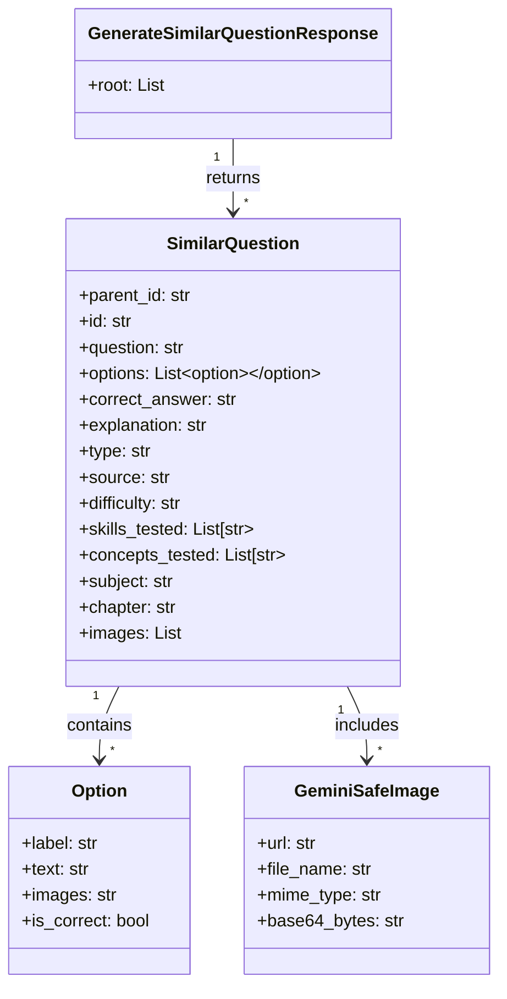

## Introduction

At the end of my sophomore year at NIT Karnataka, I started searching for research internships in AI/ML at institutes like IITs, IISc, and other research labs. I was very interested in getting hands-on experience in artificial intelligence and machine learning through academic research.

During this process, I was fortunate enough to secure a few research opportunities, including:

- Research Intern at IIT Dharwad  
- Research Intern in Explainable AI at IIT Jammu  

While these were great opportunities, something unexpected happened in April.

## Joining Kalppo
Through the Web Enthusiasts Club (WEC)  a great technical club at NITK I got a referral for an internship at **Kalppo**, an EdTech startup. The referral came from a senior in the club who was already working there as an intern. He introduced me to the team at Kalppo and suggested that I go through the interview process.

I agreed to take the interview.

My technical interview was conducted in the last week of April by [Abhishek Kumar](https://www.linkedin.com/in/abhishekkumar2718/), the CTO and Tech Lead at Kalppo. The interview mostly revolved around my resume, the projects I had worked on, and my experience with machine learning systems.

We discussed things like:

- My work with vector databases  
- The ML systems I had built  
- My experience participating in Kaggle competitions  

One of the highlights discussed during the interview was my result in the **Kaggle × Skill Assessment Machine Learning Competition**, where I was ranked **1st out of 1,846 participants**.

The interview was quite technical but also very interesting because it focused on how I approached problems and built systems, rather than just theoretical questions.

About two days later, I received a call from [Avinash Kumar](https://www.linkedin.com/in/avinash136/) from the HR team at Kalppo. We discussed the role, expectations, and a few details about the internship.

The very next day, I received the confirmation 🙂

My internship at **Kalppo** officially started on **May 10th** and continued until **July 20th**.

Those two months turned out to be one of the most challenging, interesting, and enjoyable experiences I had during my early years in tech. It was my first time working professionally as an AI Engineer Intern, and doing it in a fast-moving EdTech startup environment made the experience even more intense and exciting.

In the following sections, I will talk about the projects I worked on, the people I interacted with, and the things I learned during this journey at Kalppo.


## Team and Mentors

In the first week of May, around 3 interns were selected to join Kalppo. We had our first team meeting where Abhishek Kumar and Avinash Kumar introduced us to the team and the product they had been building over the past six months.

During the meeting, they gave us a demo of the platform and explained the main idea behind the startup. Kalppo is an EdTech startup focused on helping offline coaching institutes bring their teaching systems online.

The product was designed to help coaching institutes:

* create and manage batches of students
* conduct mock quizzes and tests
* manage learning material and progress tracking

The primary focus was on **JEE and NEET coaching**, which makes sense because many coaching institutes in India operate offline on a relatively small scale. The idea was simple but powerful provide them with tools to run their coaching programs online for their students.

Apart from this core product, the team was also working on several other supporting tools and features that could improve the learning experience for both teachers and students.

After the introduction and product demo, we had a fun activity to break the ice. Everyone had to share three statements about themselves, where two statements were true and one was false, and the rest of the group had to guess which one was incorrect.

It was a simple but very engaging activity and helped everyone get comfortable with each other. Since many of us were meeting for the first time, it made the environment much more relaxed.

Overall, it was a great experience meeting the team and mentors. The session helped us understand the **vision behind the startup**, the product they were building, and the people we would be working with over the next few months.


Below is a **clean `.md` section** you can paste under **`## Projects I Worked On`** in your post.
It follows your structure:

1. Brief overview of the three projects
2. Detailed explanation of the **first project (STEM Question Generation)**
3. Includes **Python code blocks, Mermaid diagram, and TikZ example**


## Projects I Worked On

During my internship at Kalppo, I mainly worked on three AI-focused projects that were closely related to the EdTech platform.

STEM Question Generation
The goal of this system was to automatically generate **similar questions for an existing question** so that coaching institutes could expand their **question banks**. This would allow students to practice more variations of a concept instead of repeating the same problems.

AI Question Extraction Pipeline
This pipeline focused on **extracting questions from uploaded documents such as PDFs or scanned worksheets**. The system used OCR and structured parsing to convert raw documents into **structured question objects** that could be stored in the database.

Workbook Evaluation App
This project focused on building an **AI-powered evaluation system** where students could upload workbook answers and the system could automatically evaluate them using LLM-based reasoning and answer matching.


### 1. STEM Question Generation

After our initial onboarding meeting, the following Monday I had a **one-on-one discussion with Abhishek Kumar (CTO)** regarding my experience with AI frameworks and the projects I had previously worked on.

Based on this discussion, the **first major task assigned to me** was to build a system that could generate **k similar questions** for a given input question.

The idea was simple:

- Take an existing JEE-level question
- Generate **multiple variations of the same concept**
- Store them in the database
- Expand the **practice question bank** for coaching institutes

This helps students practice more problems that test the **same concept with slightly different variations**.


#### Experimenting with AI Workflows

I started experimenting with different **AI workflows inside Jupyter notebooks**.

The basic pipeline looked like this:

1. Input question
2. Prompt generation
3. Send prompt to LLM
4. Parse structured JSON output
5. Store in database

#### Prompt Layer

To generate similar questions, I first designed a **prompt layer** responsible for converting input questions into structured prompts for the LLM.

Instead of writing raw prompts everywhere in the codebase, I created a **prompt management layer** that dynamically renders prompts depending on:

- subject (math / physics / chemistry)
- chapter
- number of variations required
- question type

For example, chemistry questions belonging to **organic chemistry chapters** used a different prompt template because they required **SMILES representations for molecular structures**.


#### Prompt Rendering Logic

Below is the simplified Python implementation used to render prompts.

```python
from app.prompts.prompt_manager import PromptManager
from app.schema.question import Question
import json

class GenerateSimilarQuestionPrompt:

    _supported_subjects = {"math", "physics", "chemistry"}

    _organic_chapters = {
        "Alkanes",
        "Alkenes and Alkynes",
        "Alcohols",
        "Aldehydes and Ketones",
        "Carboxylic Acids",
        "Aromatic Compounds (Benzene and its Derivatives)"
    }

    @staticmethod
    def render(questions: list[Question], subject: str, k: int) -> str:

        subject = subject.lower()

        if subject not in GenerateSimilarQuestionPrompt._supported_subjects:
            raise ValueError("Unsupported subject")

        questions_json = json.dumps([
            {
                "id": q.id,
                "question": q.question,
                "subject": q.subject,
                "options": [opt.model_dump() for opt in q.options] if q.options else [],
                "type": q.type,
                "chapter": q.chapter,
            }
            for q in questions
        ], indent=2)

        return PromptManager.render(
            "generate_similar_question_prompt",
            questions_json=questions_json,
            subject=subject,
            k=k
        )
```

This prompt was then sent to the **LLM**, which generated similar questions in **structured JSON format**.


#### Prompt Generation Pipeline

The overall prompt pipeline looked like this:


#### Why a Prompt Layer Was Important

This abstraction allowed the system to:

* reuse prompt templates across subjects
* dynamically modify prompts depending on chapters
* maintain versioned prompts
* enforce structured outputs

It also made experimentation easier when testing different prompt strategies for **STEM question generation**.


#### LLM Model

For the generation pipeline I used:

* **Gemini 2.5**
* **Gemini 2 Pro**

These models worked well for generating **conceptually similar but diverse questions**.

I used the **Gemini Python API** together with **Pydantic schemas** to validate responses.

#### Question Schema

The generated questions were validated using a **Pydantic schema**.



This ensured that the LLM output always followed the **correct structured format**.


#### Backend API

Once the pipeline was stable, I built a **FastAPI endpoint** that allowed the system to generate similar questions.

Example endpoint:

```python
from fastapi import APIRouter
from typing import List

router = APIRouter()

@router.post("/generate_similar_question")
def generate_similar_question_route(request):
    similar_questions = generate_similar_question(
        questions=request.questions,
        subject=request.questions[0].subject,
        number_of_generated_questions_per_question=request.number
    )
    return {"similar_questions": similar_questions}
```

The API:

* accepts a list of questions
* generates variations
* returns structured JSON


#### Handling Subject-Specific Content

Each subject required slightly different handling.

#### Mathematics

Math questions mainly relied on **LaTeX formatting** and symbolic expressions.


#### Chemistry (SMILES notation)

For **organic chemistry questions**, I used **SMILES representation** to generate molecular structures.

Example:

```
<smiles>CC(O)=O</smiles>
```

This allowed the system to generate organic chemistry questions involving **molecular structures**.


#### Physics (Circuit Diagrams)

For chapters like:

* Current Electricity
* Alternating Current
* Capacitance

I used **LaTeX + CircuitTikZ** to generate circuit diagrams.

Example:

```latex
\begin{circuitikz}
(0,0) to[sV, l=$V_p\sin(\omega t)$] (0,4)
to[R, l=$R$] (4,4)
to[C, l=$C$] (4,0)
to[short] (0,0);
\end{circuitikz}
```

These diagrams were rendered into images and attached to questions.

<div class="row mt-3">
    <div class="col-sm-8 mt-3 mt-md-0">
        
    </div>
</div>

<div class="caption">
Example circuit diagram generated using LaTeX CircuitTikZ and rendered into an image by the pipeline.
</div>


---

#### Example Result: Generated Question Variations

Below is an example showing how the system generates **multiple variations of a given question** while preserving the underlying concept.


#### Original Question

**Question ID:** B-33  

**Question**

Evaluate the integral:

$$
\int_{-1}^{1} \cot^{-1}\left(\frac{x + x^{3}}{1 + x^{4}}\right) \, dx
$$

**Options**

- **A**: $2\pi$
- **B**: $\frac{\pi}{2}$
- **C**: $0$
- **D**: $\pi$

**Correct Answer:** **D** — $\pi$


#### Generated Variation 1

**Question ID:** B-33  
**Sub ID:** B-33-1

**Question**

Evaluate

$$
\int_{0}^{1} \tan^{-1}\left(\frac{2x}{1 - x^2}\right) \, dx
$$

**Options**

- **A**: $\frac{\pi}{2}$
- **B**: $\frac{\pi}{4}$
- **C**: $0$
- **D**: $\pi$

**Correct Answer:** **D** — $\pi$


#### Generated Variation 2

**Question ID:** B-33  
**Sub ID:** B-33-2

**Question**

Find the value of

$$
\int_{-\pi/2}^{\pi/2} \sin^{-1}\left(\frac{2x}{1+x^2}\right) \, dx
$$

**Options**

- **A**: $0$
- **B**: $\pi$
- **C**: $\frac{\pi}{2}$
- **D**: $-\pi$

**Correct Answer:** **A** — $0$


#### System Architecture Diagram

```typograms
-------------------------------------------------------------------------------------------------------.
|                                     STEM QUESTION GENERATION SYSTEM                                  |
'-------------------------------------------------------------------------------------------------------'
            |
            v
.-------------------------------------------------------------------------------------------------------.
|                                         FASTAPI BACKEND API                                           |
|                                                                                                       |
|   POST /generate_similar_question                                                                     |
|   - Accepts list of questions                                                                         |
|   - Accepts number_of_generated_questions_per_question                                                |
'-------------------------------------------------------------------------------------------------------'
            |
            v
.-------------------------------------------------------------------------------------------------------.
|                                          REQUEST PARSER                                               |
|                                                                                                       |
|  - Pydantic Schema Validation                                                                         |
|  - Question Object Conversion                                                                         |
|  - Subject Detection (Math / Physics / Chemistry)                                                     |
'-------------------------------------------------------------------------------------------------------'
            |
            v
.-------------------------------------------------------------------------------------------------------.
|                                            PROMPT LAYER                                               |
|                                                                                                       |
|  Jinja Prompt Template                                                                                |
|                                                                                                       |
|  - GenerateSimilarQuestionPrompt.render()                                                             |
|  - Dynamic Prompt Versioning                                                                          |
|  - Organic Chemistry Detection                                                                        |
|  - Inject Question JSON                                                                               |
|                                                                                                       |
|  Output → Structured LLM Prompt                                                                       |
'-------------------------------------------------------------------------------------------------------'
            |
            v
.-------------------------------------------------------------------------------------------------------.
|                                         GEMINI LLM CALL                                               |
|                                                                                                       |
|   Google Gemini API                                                                                   |
|                                                                                                       |
|   Models Used                                                                                         |
|   - gemini-2.5-pro                                                                                    |
|   - gemini-2.0-flash                                                                                  |
|                                                                                                       |
|   Task                                                                                                 |
|   - Generate K Similar Questions                                                                      |
|   - Maintain Concept Consistency                                                                      |
|   - Produce Structured JSON Output                                                                    |
'-------------------------------------------------------------------------------------------------------'
            |
            v
.-------------------------------------------------------------------------------------------------------.
|                                      STRUCTURED OUTPUT VALIDATION                                     |
|                                                                                                       |
|  Parse JSON Response                                                                                  |
|                                                                                                       |
|  Pydantic Models                                                                                      |
|     SimilarQuestion                                                                                   |
|     Option                                                                                            |
|     GeminiSafeImage                                                                                   |
|                                                                                                       |
|  Ensures                                                                                              |
|  - Schema correctness                                                                                 |
|  - Correct question structure                                                                         |
|  - Valid options and answers                                                                          |
'-------------------------------------------------------------------------------------------------------'
            |
            v
.-------------------------------------------------------------------------------------------------------.
|                               OPTIONAL PHYSICS CIRCUIT DIAGRAM GENERATION                             |
|                                                                                                       |
|   If Chapter ∈ { Current Electricity, Capacitance, AC }                                               |
|                                                                                                       |
|      Gemini → Generate CircuitTikZ LaTeX Code                                                         |
|      ↓                                                                                                |
|      LaTeX Rendering Engine                                                                           |
|      ↓                                                                                                |
|      Convert → PNG Image                                                                              |
|      ↓                                                                                                |
|      Upload → Supabase Storage                                                                        |
'-------------------------------------------------------------------------------------------------------'
            |
            v
.-------------------------------------------------------------------------------------------------------.
|                                      DATABASE STORAGE LAYER                                           |
|                                                                                                       |
|  PostgreSQL                                                                                           |
|                                                                                                       |
|  Tables                                                                                                |
|   - Questions                                                                                         |
|   - Options                                                                                           |
|   - Images                                                                                            |
|                                                                                                       |
|  Stored Data                                                                                          |
|   - Generated Question Variations                                                                     |
|   - Answers & Explanations                                                                            |
|   - Circuit Diagrams                                                                                  |
'-------------------------------------------------------------------------------------------------------'
            |
            v
.-------------------------------------------------------------------------------------------------------.
|                                        FINAL API RESPONSE                                             |
|                                                                                                       |
|  FastAPI returns                                                                                      |
|                                                                                                       |
|  GenerateSimilarQuestionResponse                                                                      |
|                                                                                                       |
|  JSON Response                                                                                        |
|                                                                                                       |
|  {                                                                                                    |
|      "similar_questions": [...]                                                                       |
|  }                                                                                                    |
'-------------------------------------------------------------------------------------------------------'
```
